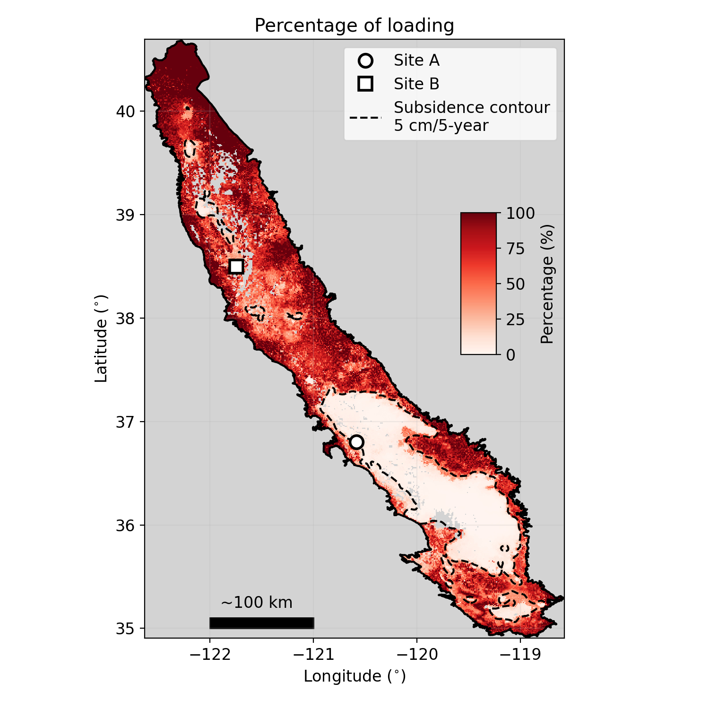

# Isolating the Poroelastic Response of the Groundwater System in InSAR Data from the Central Valley of California

This repository provides a set of Jupyter noteobooks used to conduct numerical analysis used in our research paper titled: 
"Isolating the Poroelastic Response of the Groundwater System in InSAR Data from the Central Valley of California". 

